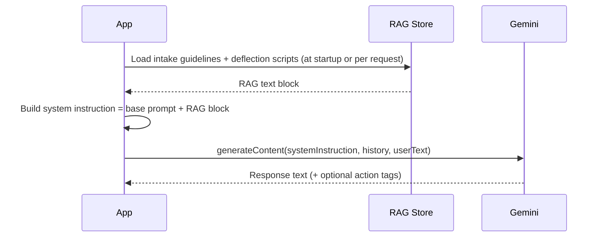

# Gemini System Prompt and RAG Content

This document describes the structure and content of the Gemini system prompt, RAG (Retrieval Augmented Generation) usage, and guidelines for updating and testing conversational logic in the Legal Intake Voice Service (Sovereign Voice).

**Audience:** Developers, AI/ML Engineers, Compliance Officers.

---

## 1. Gemini System Prompt Structure

The system prompt defines how the AI presents itself, what it may and may not do, and how it should respond. It is configured in code and (optionally) overridden by environment or config files.

### 1.1 Persona Definition

The AI is defined as the **attorney's intake assistant** for a bankruptcy law practice. It should:

- Identify as an AI assistant (mandatory disclosure; see Ethical Boundaries).
- Use a professional, empathetic tone appropriate for callers in financial distress.
- Speak in short, voice-optimized sentences (no long paragraphs).

**Current implementation:** The persona is established in the system instruction passed to Vertex AI Gemini. Example (from `src/nodejs/gemini_client.js`):

```javascript
const DEFAULT_SYSTEM_PROMPT = `You are an AI intake assistant for a bankruptcy law practice. Your role is to gather initial information from callers only. You do not give legal advice. Keep responses concise and suitable for voice (short sentences). Be empathetic and professional.`;
```

### 1.2 Role and Purpose

- **In scope:** Initial information gathering only (debt, income, assets, contact details, and factual case context).
- **Out of scope:** Legal advice, case strategy, interpretation of law, or recommendations (e.g., "you should file Chapter 7").

The system prompt must explicitly state that the AI **does not give legal advice** so that Gemini adheres to this boundary across turns.

### 1.3 Ethical Boundaries

The following are embedded in (or will be added to) the system prompt and RAG content:

| Boundary | Description |
|----------|-------------|
| **AI disclosure** | Callers must be told they are speaking with an AI assistant (Ohio Rules of Professional Conduct). |
| **UPL avoidance** | Unauthorized Practice of Law: the AI must not provide legal advice; it deflects and tags questions for attorney review. |
| **PII handling** | The AI must not encourage callers to spell out full SSNs or other PII in a way that would be stored in raw form; redaction is applied post-call. |

Prompt text should include explicit instructions such as:

- "You do not give legal advice."
- "If the caller asks for legal advice, acknowledge the question and state that you will note it for the attorney to address."
- "Do not interpret laws or recommend specific legal actions."

### 1.4 Context Management

Conversation state is maintained **per WebSocket connection** (per call):

- **History format:** Alternating `user` and `model` turns with `text` (or `parts[].text`).
- **Usage:** Each new user utterance is sent to Gemini along with prior turns via `buildContents(history, userText)`. The model receives the full history for the current call only.
- **Lifecycle:** Context is created when the WebSocket session starts and cleared when the connection closes. No cross-call context is retained.

To avoid context-window bloat and keep Time to First Token (TTFT) low:

- Keep the system prompt and any injected RAG content concise.
- Optionally trim or summarize very long conversations before sending (e.g., keep last N turns or a summary plus recent turns).

### 1.5 Output Directives and Action Tags

The model is expected to produce **plain text** suitable for TTS. Optional **action tags** in the response text drive downstream behavior:

- **Format:** Inline tags in square brackets, e.g. `[ask_income]`, `[deflect_upl]`, `[tone_empathetic]`.
- **Extraction:** The application parses tags with a regex (e.g. `\[([a-z_]+)\]`) and can use them for:
  - Follow-up question flow (e.g. ask income after debt is mentioned).
  - UPL deflection (trigger a grounding deflection and tag the question for attorney review).
  - Tone adjustment (e.g. pass SSML or a hint to TTS for empathetic delivery).

The system prompt should describe these tags and when to use them so that Gemini outputs them consistently.

---

## 2. RAG Content Overview

**Retrieval Augmented Generation (RAG)** in Sovereign Voice means injecting **firm-specific, non-advice content** into the Gemini prompt so that the model can:

- Follow the firm’s standard intake flow and question sets.
- Use pre-approved deflection scripts when callers ask for legal advice.
- Stay within ethical and compliance boundaries without hallucinating legal guidance.

RAG content is **retrieved** (from files, a knowledge base, or a database) and **appended or referenced** in the system instruction or in a dedicated context block so that Gemini has it in every request. It is **not** used to generate legal advice; it provides structure (e.g., intake guidelines) and safe, approved phrasing (e.g., deflection scripts).

---

## 3. RAG Content Sources and Structure

### 3.1 Intended Storage and Format

| Content type | Purpose | Suggested location | Format |
|--------------|---------|--------------------|--------|
| Intake guidelines | Standard questions, order of topics, means-test–related prompts | `docs/ai_config/` or a dedicated `rag/` directory | Markdown or JSON |
| Deflection scripts | Pre-approved phrases for UPL deflection and next steps | Same as above | Plain text or JSON (e.g. `{ "trigger": "legal_advice", "script": "..." }` |
| Action tag definitions | Mapping of tags to intended behavior (for prompt and docs) | In system prompt or `docs/ai_config/` | Markdown table or JSON |

**Current state:** RAG is implemented in `src/nodejs/gemini_prompt_manager.js`. It loads `config/rag/intake_guidelines.md` and `config/rag/deflection_scripts.json` at startup, concatenates them with the base system prompt, and passes the combined text as the system instruction when creating the Gemini model. Optional env: `RAG_CONFIG_DIR` to override the RAG directory.

### 3.2 Organization for Retrieval and Injection

- **Single-file option:** One Markdown file (e.g. `intake_guidelines.md`) containing sections for intake flow, deflection scripts, and action tags. The full file (or a subset) is read at startup and appended to the system instruction.
- **Multi-file option:** Separate files per category (e.g. `intake_guidelines.md`, `deflection_scripts.json`). The app loads and concatenates them in a defined order to form the RAG block.
- **Version control:** RAG files should be stored in the repo and versioned so that changes are auditable and deployable with the application.

A simple flow for how RAG is intended to be used in a conversational turn:



---

## 4. Updating and Testing Conversational Logic

### 4.1 Modifying the Gemini System Prompt

- **Code change:** Edit `DEFAULT_BASE_PROMPT` in `src/nodejs/gemini_prompt_manager.js` for the base persona and rules; edit `config/rag/intake_guidelines.md` and `config/rag/deflection_scripts.json` for RAG content. The app uses `getSystemInstruction()` from the prompt manager when creating the Gemini model in `index.js`.
- **Config override (future):** If a config file or environment variable is introduced (e.g. `GEMINI_SYSTEM_PROMPT_PATH`), update that file or value instead of code for easier, non-code deployments.
- **Version control:** Commit prompt changes with clear commit messages and, if applicable, reference a change request or compliance review.

### 4.2 Updating and Adding RAG Content

- Add or edit files in the chosen RAG directory (e.g. `docs/ai_config/` or `config/rag/`).
- Keep a consistent structure (sections in Markdown, or keys in JSON) so that the loader does not need to change for every content edit.
- After adding or changing deflection scripts or intake guidelines, run the tests described below and do a short manual test call to confirm behavior.

### 4.3 Testing the Impact of Changes

- **Unit tests:** `src/nodejs/gemini_client.test.js` checks that the default system prompt includes expected concepts (e.g. "intake", "legal advice"). Extend tests to assert required phrases or structure when the prompt or RAG format changes.
- **UPL deflection:** Use test cases that ask direct legal questions (e.g. "Should I file Chapter 7?" or "Will I lose my house?"). Verify that:
  - The model’s reply does not give legal advice.
  - Deflection language matches (or is consistent with) the approved scripts.
  - Any action tag for deflection (e.g. `[deflect_upl]`) is present when expected.
- **Empathetic tone:** For utterances containing high-stress keywords (e.g. "foreclosure", "garnishment"), verify that responses are appropriate and that tone-related action tags (if used) are emitted.
- **Regression:** Re-run any end-to-end or integration tests that hit the STT → Gemini → TTS pipeline to ensure latency and correctness are still acceptable.

### 4.4 Version Control and Auditing

- Store the system prompt (and any prompt fragments) in the repo, either in code or in dedicated files under `docs/ai_config/` or `config/`.
- Store RAG content in the repo and tag releases so that compliance and engineering can trace which prompt and RAG version was live at a given time.

---

## 5. Examples of Prompt and RAG Techniques

### 5.1 Example: Persona and Role in the System Prompt

```text
You are an AI intake assistant for a bankruptcy law practice. You speak on behalf of [Attorney Name]'s office. Your role is to gather initial information from callers only. You do not give legal advice. Keep responses concise and suitable for voice (short sentences). Be empathetic and professional. If the caller asks for legal advice, say you will note the question for the attorney and redirect to information gathering.
```

### 5.2 Example: Intake Guideline (RAG Content)

When RAG is loaded from a file, a section might look like:

```markdown
## Intake flow (order of topics)
1. Greeting and confirm they are calling about bankruptcy.
2. Ask for name and best callback number.
3. Ask about types of debt (credit cards, medical, mortgage, etc.).
4. Ask about household income and employment.
5. Ask about major assets (home, vehicle).
6. Note any specific legal questions for attorney review; do not answer them.
```

### 5.3 Example: UPL Deflection Script (RAG Content)

```json
{
  "id": "deflect_legal_advice",
  "script": "That's an important question. I'll make a note of it so [Attorney Name] can review your situation and get back to you with a precise answer. For now, may I ask..."
}
```

Or in plain text for inclusion in the system prompt:

```text
When the caller asks for legal advice, respond with: "That is an important question. I will note it so [Attorney Name] can review your specific situation and get back to you. In the meantime, may I ask..."
```

### 5.4 Example: Tone Adjustment Directive

If the model is instructed to emit a tag when it detects stress-related language, the system prompt might include:

```text
If the caller mentions foreclosure, garnishment, sheriff sale, or similar high-stress events, include [tone_empathetic] in your response so the system can adjust voice tone. Keep your wording supportive and brief.
```

The application can then parse `[tone_empathetic]` and pass SSML or parameters to the TTS layer (see BE-008).

---

## 6. Acceptance Checklist

- [x] Gemini system prompt and its configuration are fully documented (persona, role, ethical rules, context management).
- [x] RAG content sources, structure, and integration method are clearly outlined (current code state and intended design).
- [x] Guidelines for updating and testing Gemini's conversational logic and RAG content are provided and actionable.
- [x] Documentation includes practical examples of prompt snippets and RAG content for persona, intake guidelines, deflection, and tone.

---

## 7. Related Code and Docs

| Resource | Description |
|----------|-------------|
| `src/nodejs/gemini_client.js` | Vertex AI client, `getGenerativeModel`, `buildContents`, `generateResponse`, `extractActionTags` |
| `src/nodejs/gemini_prompt_manager.js` | Builds system prompt from base + RAG; loads `config/rag/intake_guidelines.md` and `config/rag/deflection_scripts.json`; exports `getSystemInstruction()` for Gemini. |
| `src/nodejs/index.js` | WebSocket server, per-call conversation context, STT → Gemini → TTS flow; uses `getSystemInstruction()` from prompt manager. |
| `docs/api_and_deployment/deployment_guide.md` | Deployment and environment (e.g. `GOOGLE_CLOUD_PROJECT` for Gemini) |
| `docs/setup/twilio_media_streams.md` | Twilio and pipeline overview (STT, Gemini, TTS) |
